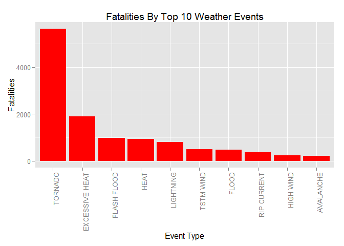
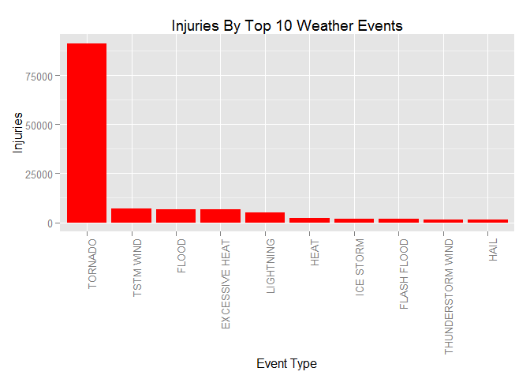
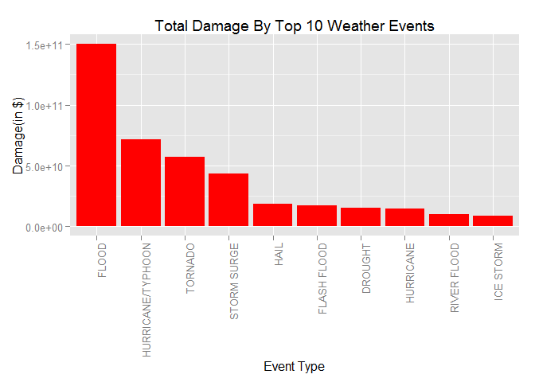

# Exploring the NOAA Storm Database : Health and Economic impacts of Severe Weather in the US
Divydeep Agarwal  
July 24, 2015  

##Assignment
The basic goal of this assignment is to explore the NOAA Storm Database and answer some basic questions about severe weather events. You must use the database to answer the questions below and show the code for your entire analysis. Your analysis can consist of tables, figures, or other summaries. You may use any R package you want to support your analysis.

##Synopsis
The National Oceanic and Atmospheric Administration (NOAA) maintains a public database for storm event. The data contains the type of storm event, details like location, date, estimates for damage to property as well as the number of human victims of the storm. In this report we investigate which type of events are the most harmful to the population and financially.

The conclusion is that the impact on humans, be it injuries or fatalities, isn't directly correlated to the ecomomic damage weather events cause.

Tornadoes are the #1 cause for fatalities and injuries in the US.

In terms of economic damage(both property and crops), the top 3 events are Floods, Hurricane/Typhoon and Tornado.

##Data Processing


```r
#Load the required libraries
library(dplyr)  #For aggregate and arrange function
```

```
## 
## Attaching package: 'dplyr'
## 
## The following objects are masked from 'package:stats':
## 
##     filter, lag
## 
## The following objects are masked from 'package:base':
## 
##     intersect, setdiff, setequal, union
```

```r
library(ggplot2)  #For creating plots
```


```r
#Load the NOAA dataset
StormDS <- read.csv(file = "repdata_data_StormData.csv.bz2")
```


```r
#Subset the data to include only required columns
StormSS <- select(StormDS, EVTYPE, FATALITIES, INJURIES, PROPDMG, PROPDMGEXP, CROPDMG, CROPDMGEXP)
```


```r
#Function to calculate damage in dollars using numerical value and exponent
#Converts "H", "K", "M", "B" units to numbers
calcValue <- function(num, exp){
  pow <- 0
  if(is.numeric(exp)){
    pow <- exp 
  }
  else if(grepl("h", exp, ignore.case = T)){
    pow <- 2
  }
  else if(grepl("k", exp, ignore.case = T)){
    pow <- 3
  }
  else if(grepl("m", exp, ignore.case = T)){
    pow <- 6
  }
  else if(grepl("b", exp, ignore.case = T)){
    pow <- 9
  }  
  else if(exp == "" || exp == " "){
    pow <- 0
  }  
  else {
    pow <- NA
  }
  
  if(is.numeric(num)){
    num <- num * (10^pow)
  }
  else {
    num <- 9
  }
}
```


```r
#Calculate the Property Damage
StormSS$PROPDMGNUM <- mapply(calcValue,StormSS$PROPDMG,StormSS$PROPDMGEXP)
```


```r
#Calculate the Crop Damage
StormSS$CROPDMGNUM <- mapply(calcValue,StormSS$CROPDMG,StormSS$CROPDMGEXP)
```

##Results
###Across the United States, which types of events (as indicated in the EVTYPE variable) are most harmful with respect to population health?


```r
#Aggregate fatalities by event type
#Using only top 10 weather events causing the most fatalities for plotting
fatalities <- aggregate(StormSS$FATALITIES ~ StormSS$EVTYPE, data = StormSS,FUN = sum)
names(fatalities) <- c("EVTYPE","FATALITIES")
fatalities <- arrange(fatalities,desc(FATALITIES))
fatalities <- head(fatalities, n = 10)
fatalities$EVTYPE <- factor(fatalities$EVTYPE, levels = fatalities$EVTYPE)

ggplot(data = fatalities,aes(EVTYPE,FATALITIES)) + geom_bar(stat="identity",fill="red") + labs(x = "Event Type", y= "Fatalities", title="Fatalities By Top 10 Weather Events") + theme(axis.text.x = element_text(angle = 90, hjust = 1))
```

 


```r
#Aggregate injuries by event type
#Using only top 10 weather events causing the most injuries for plotting
injuries <- aggregate(StormSS$INJURIES ~ StormSS$EVTYPE, data = StormSS, FUN = sum)
names(injuries) <- c("EVTYPE", "INJURIES")
injuries <- arrange(injuries, desc(INJURIES))
injuries <- head(injuries, n = 10)
injuries$EVTYPE <- factor(injuries$EVTYPE, levels = injuries$EVTYPE)

ggplot(data=injuries, aes(EVTYPE,INJURIES)) + geom_bar(stat="identity",fill="red") + labs(x = "Event Type", y= "Injuries", title="Injuries By Top 10 Weather Events") + theme(axis.text.x = element_text(angle = 90, hjust = 1))
```

 

###Across the United States, which types of events have the greatest economic consequences?


```r
#Aggregate total damage(property + crop) by event type
#Using only top 10 weather events causing the most damage for plotting
damages <- aggregate(PROPDMGNUM + CROPDMGNUM ~ EVTYPE,data = StormSS, FUN = sum)
names(damages) <- c("EVTYPE","DAMAGES")
damages <- arrange(damages,desc(DAMAGES))
damages <- head(damages,n=10)
damages$EVTYPE <- factor(damages$EVTYPE,levels = damages$EVTYPE)

ggplot(data = damages, aes(EVTYPE, DAMAGES)) + geom_bar(stat="identity",fill="red") + labs(x = "Event Type", y= "Damage(in $)", title="Total Damage By Top 10 Weather Events") + theme(axis.text.x = element_text(angle = 90, hjust = 1))
```

 
